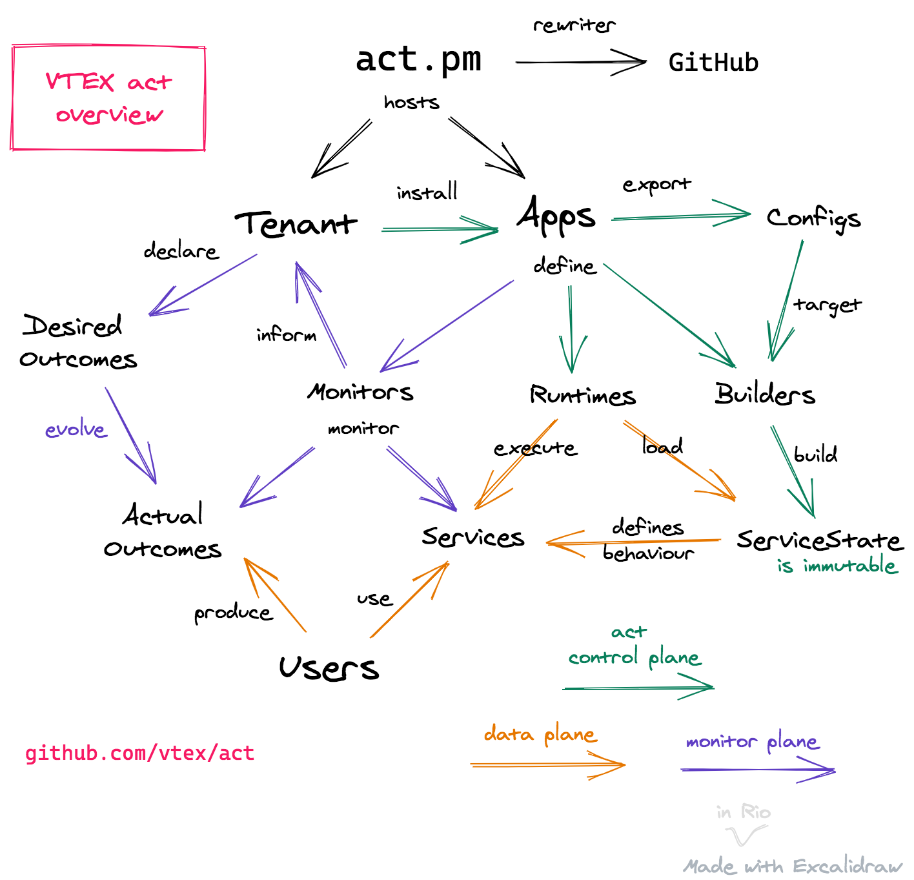

# act - WORK IN PROGRESS 

> *~think~ act different*

*app config tree*  
*automatic config tool*  
*autonomy creates trust*  
*alignment causes transformation*  
*TODO: create a three-word image generator as WIP for act itself.*  

`act` is a CLI tool that manages service configuration in a predictable, explicit and versioned way. 

`act` helps **developers** make services configurable by allowing them to declare *builders* that build *configs* into an *immutable service state* for consumption by a *runtime*. 

`act` helps **application users** manage service configuration by allowing them to install and uninstall *apps* (packages of builders, configs or runtimes) in *tenants*, which result in different behaviours when combined. 

`act` treats *code as configuration*, inspired by [Facebook's `configerator`](https://research.fb.com/wp-content/uploads/2016/11/holistic-configuration-management-at-facebook.pdf) and VTEX IO [`apps and workspaces`](https://vtex.io/docs/concepts/workspace/).

`act` is based on `git` and `deno`. It uses `git` to version both tenants and apps. It uses `deno` to implement a DSL that defines the core concepts of `builders`, `runtimes`, `configs`, etc.

`act` is intended to be used as your **control plane**. It builds and versions state which must then be made available to a **runtime**. How you deploy said runtime and how do you store said state is up to you.

`act.pm` is the canonical `act` package manager. It follows the philosophy of `deno.land/x` and implements a rewriter for GitHub. 

Contents: 

- [Getting started](/docs/getting-started.md)
- [Architecture](/docs/architecture.md)
